Lab 1: VPC and EC2
====
In this lab, you will:
+ Create a VPC, public subnet and private subnet.
+ Setup Internet Gateway and NAT Gateway to route traffic to and from the internet.
+ Setup EC2 instances with userdata inside public/private subnet as simple web server.


## Instructions
### 1. Create VPC and subnet
Go to VPC > Your VPCs > Create VPC
+ Resources to create: VPC Only
+ Name tag: lab1-vpc
+ IPv4 CIDR: 10.0.0.0/16

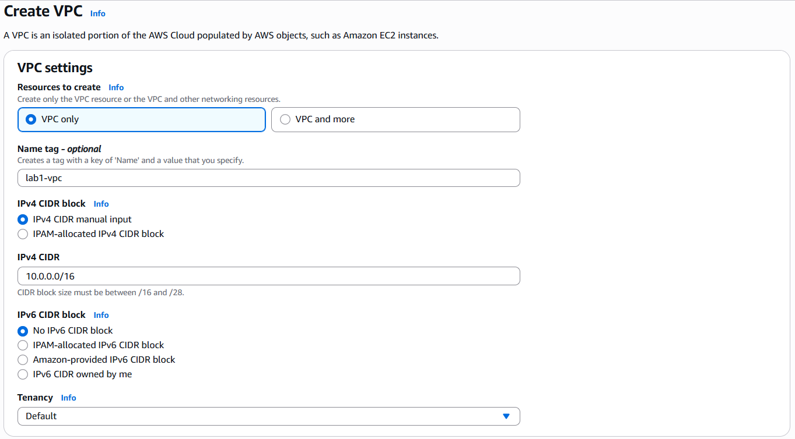

Go to VPC > Subnets > Create subnets
+ VPC ID: Choose our VPC's
+ Subnet name: lab1-subnet
+ Availability Zone: us-east-1a
+ IPv4 VPC CIDR block: 10.0.0.0/16 (Already set by default)
+ IPv4 subnet CIDR block: 10.0.1.0/24

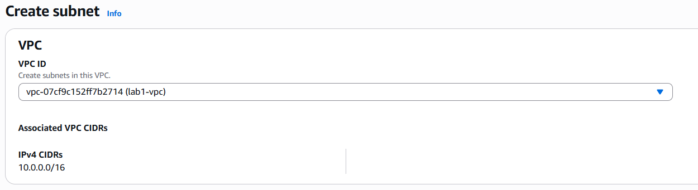
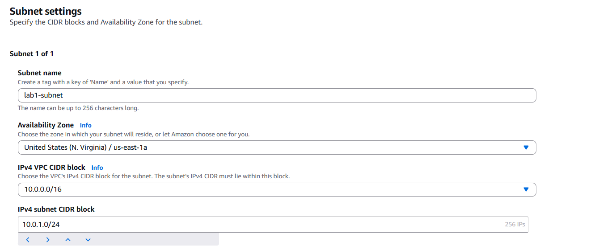

### 2. Create Internet Gateway and Route table entry
Go to VPC > Internet gateways > Create internet gateway.
+ Name tag: lab1-igw

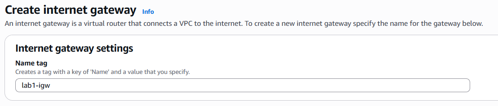

Select your IGW, in` Actions`, choose `Attach to VPC`, then pick our VPC.
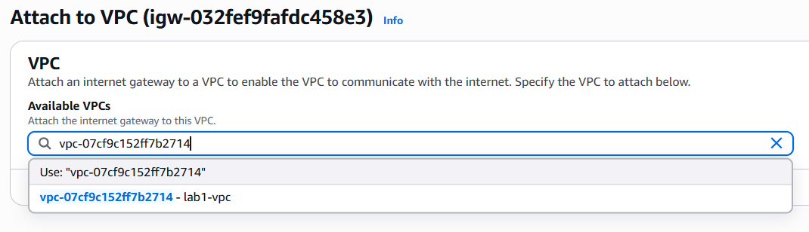

Go to `Route Tables` and select our VPC's default route table. In the `Routes` tab, click `Edit routes` and add an entry for Internet access.

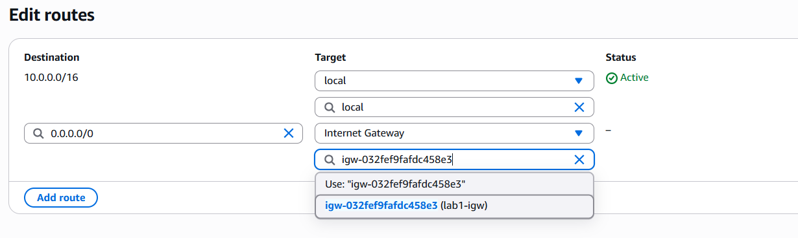
Your route table should look like this:
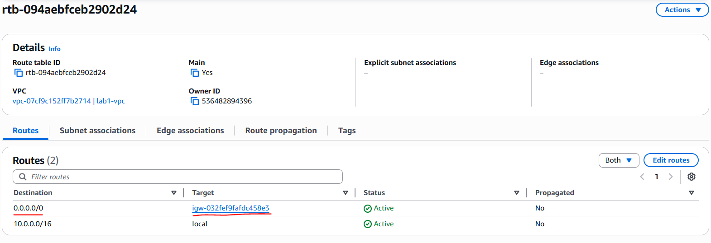

Now associate the route table with our subnet.
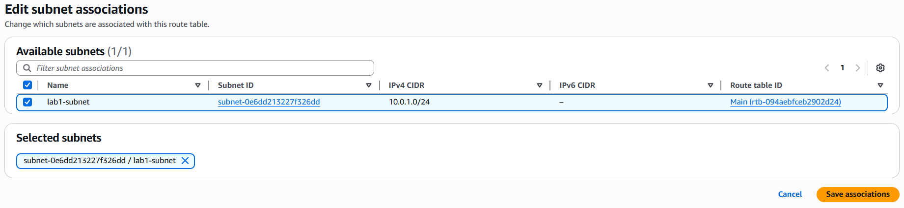

### 3. Create EC2 instance
Go to EC2 > Security Groups > Create security group.
+ Security group name: http-server
+ VPC: lab1-vpc
+ Inbound rules: Allow SSH and HTTP

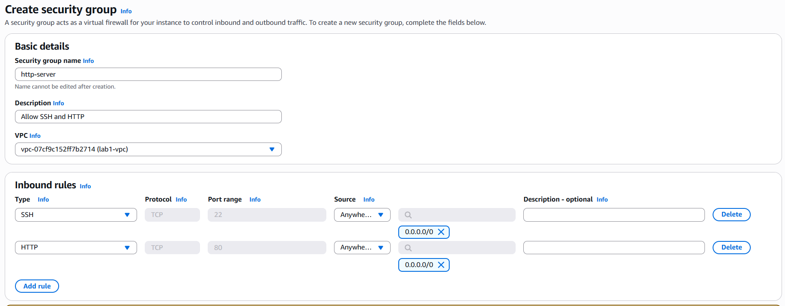

Go to EC2 > Instances > Launch an instance.
+ Name: lab1-server
+ AMI: Amazon Linux
+ Instance type: t3.micro
+ Key pair: Whatever you want
+ VPC & Subnet: lab1-vpc, lab1-subnet
+ Security groups: http-server

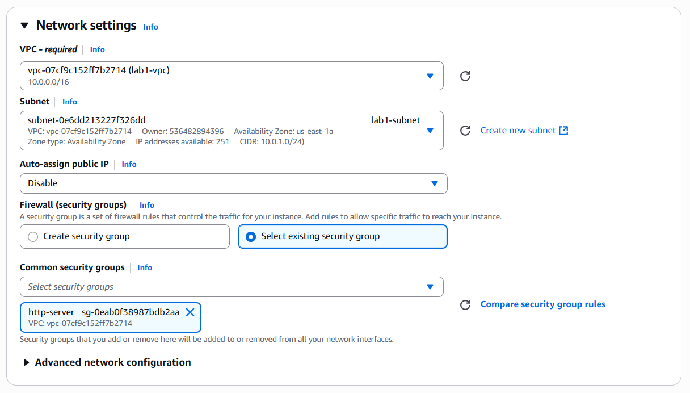

+ Advance details > Userdata:
```bash
#!/bin/bash
yum update -y
yum install -y httpd
systemctl start httpd
systemctl enable httpd
echo "<h1>Hello from TonyQ</h1>" > /var/www/html/index.html
```
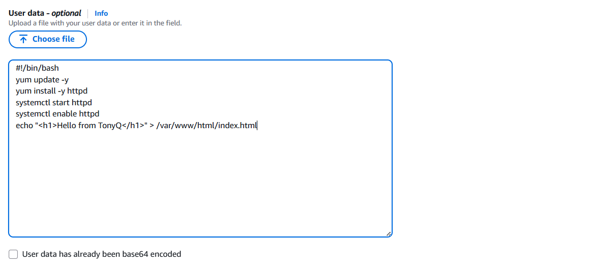

### 4. Allocate Elastic IP
Go to Elastic IPs in the EC2 sidebar.
+ Click Allocate Elastic IP
+ Choose default settings (Amazon pool)

Click Allocate.


Select the Elastic IP created.
+ Click Actions → Associate Elastic IP
+ Resource type: Instance
+ Instance: Select the EC2 instance launched earlier
+ Private IP: Use the default

Click Associate.
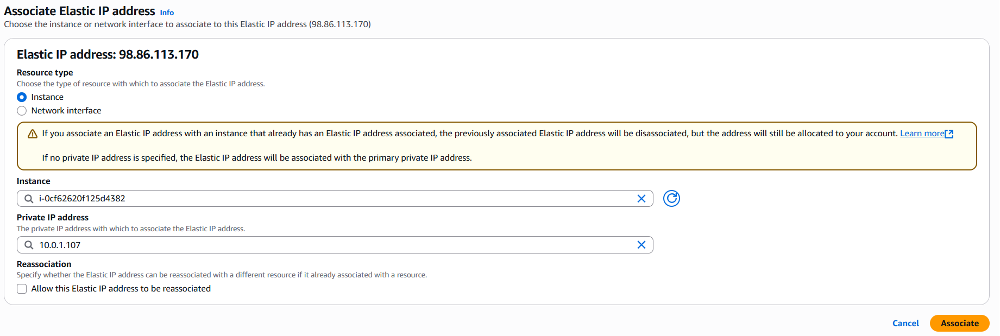
Now, the instance is reachable via this static IP address.

### 5. Connect to the web server
Using your web browser, connect to http://elastic-ip to access our server.
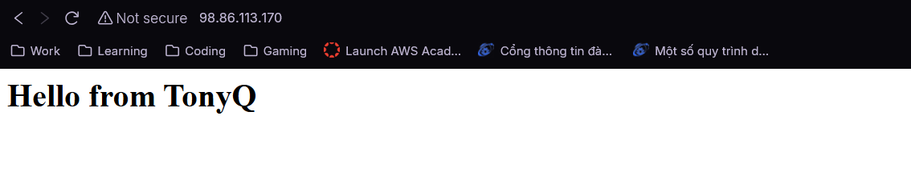

## Cleaning up
+ Disassociate and release Elastic IP.
+ Terminate EC2 instance.
+ Delete security group and VPC.