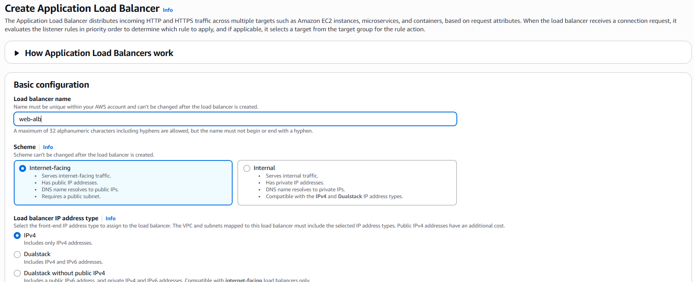

Lab 2: Auto-scaling Group and Load Balancer
====
In this lab, you will:
+ Create an ASG that automatically scales EC2 instances.
+ Setup ALB to load balances traffic.
+ Deploy a simple web server to handle traffic.

## Instructions
### 1. Create the following resources:
+ 1 VPC
+ 2 Subnets in different AZs (public IP allocation isn't necessary)
+ 1 Internet Gateway
+ 1 Route table to route public traffic


### 2. Create security group for web server
Create a Security group in our VPC that allows traffic to port 22 (SSH) and 80 (HTTP).


### 3. Create a launch template
Go to **EC2** → **Launch Templates** → **Create Launch Template**:
+ **Name**: web-template
+ **AMI**: Amazon Linux 2
+ **Instance type**: `t2.micro` or `t2.small`
+ **Key pair**: Select existing one or create new (for SSH)
+ **Network Settings**: Select **Don't include in launch template**


Go to **Advanced Details** → **User Data** (to install a simple web server):

```bash
#!/bin/bash
yum update -y
yum install -y httpd
systemctl start httpd
systemctl enable httpd
echo "<h1>Hello from TonyQ</h1>" > /var/www/html/index.html
```


Save the template.

### 4. Create an AL
Go to **EC2** → **Target Groups** → **Create target group**
+ Name: lab2-servers
+ Target type: Instance
+ Protocol: HTTP
+ Port: 80
+ Health check path: /


Go to **EC2** → **Load Balancers** → **Create Load Balancer** → **Application Load Balancer**
+ Name: web-alb
+ Scheme: internet-facing
+ IP type: IPv4
+ Listeners: HTTP (port 80)
+ VPC: select the VPC we created
+ Subnets: choose at least 2 public subnets (different AZs)
+ Security Group: choose the one we created
+ Target Group: `lab2-servers`




### 5. Create an ASG
Go to **EC2** → **Auto Scaling Groups** → **Create ASG**
+ Name: lab2-asg
+ Launch Template: select `web-template`
+ VPC: select our VPC and subnets


Load Balancing: select ALB and `lab2-servers`


Group Size:
+ Desired capacity: 1
+ Min: 1
+ Max: 3


Scaling Policies (optional for lab):
+ Policy type: Target tracking scaling policy
+ Metric: Average CPU Utilization
+ Target value: 50% (or 40% to trigger faster)
+ Instance Warmup: 300 seconds


### 6. Load testing
On a separated machine (Ubuntu) use Apache Benchmark to load test our web server:
```bash
sudo apt install apache2-utils
ab -n 1000000 -c 500 http://<ALB-DNS>/
```


The load should be enough to force the ASG to scale out.


### 7. Clean up environment
When done:
+ Delete Auto Scaling Group
+ Delete Launch Template
+ Delete Load Balancer
+ Delete Target Group
+ Delete EC2 instances (if any)
+ Delete unused security groups
+ Delete IGW, Subnet, VPC
