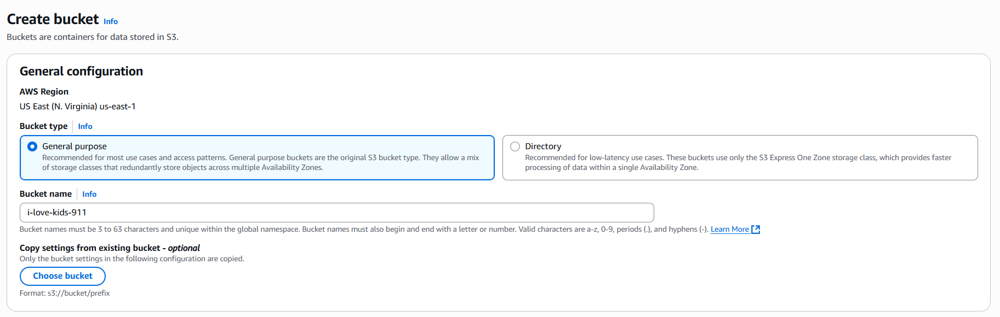

Lab 4: Amazon S3
================

In this lab, you will:
+ Create an S3 bucket, upload to and download files from the bucket.
+ Enable versioning and lifecycle policies.
+ Trigger a Lambda function on object upload.

## Lab instructions

### 1. Create a S3 bucket
Click "Create bucket"

Fill in:
+ Bucket name: Must be globally unique (e.g., my-lab-bucket-2025)
+ Region: Choose your preferred region
+ "Bucket Versioning"
+ Leave the defaults (Block all public access)

Click "Create bucket"




### 2. Add a Lifecycle Policy
In your bucket, go to the "Management" tab

+ Click "Create lifecycle rule"
+ Rule name: ExpireOldVersions
+ Choose "Apply to all objects"
+ Under "Lifecycle rule actions", check: "Permanently delete noncurrent versions of objects"
+ Set it to expire non-current versions after 30 days
+ Click "Create rule"


### 3. Create a Lambda Function for S3 Trigger

#### a. Create Lambda function
Click "Create function"

Choose:
+ Author from scratch
+ Function name: S3UploadHandler
+ Runtime: Python 3.12


For Execution role, choose a role with basic Lambda permissions


Click "Create function"

#### b. Add code
Scroll to the "Code" section

Paste this in:
```python
def lambda_handler(event, context):
    # Get the first record (usually there's only one)
    record = event['Records'][0]

    # Extract details
    bucket_name = record['s3']['bucket']['name']
    object_key = record['s3']['object']['key']
    version_id = record['s3']['object'].get('versionId', 'No version ID')

    print(f"Bucket: {bucket_name}")
    print(f"Key: {object_key}")
    print(f"Version ID: {version_id}")

    return {
        'statusCode': 200,
        'body': f"Uploaded file: {object_key}, Version ID: {version_id}"
    }
```


#### c. Set S3 Event Trigger
In Lambda console, go to your function:

+ Click "Add trigger"
+ Choose:
    - Source: S3
    - Bucket: Your bucket (my-lab-bucket-2025)
    - Event type: PUT (All object create events)
    - Prefix/suffix: Leave blank

+ Check “Add trigger”
+ Click "Add"


Lambda is now automatically invoked when a file is uploaded.


### 4. Results
1. Upload an object to our S3 bucket

```bash
aws s3 cp ./helloworld.txt s3://my-bucket/helloworld.txt 
```

2. Go to Lambda function's tab > "Monitor" > "View CloudWatch Logs"
3. Check for function's triggered log.


### 5. Clean up
1. Delete Lambda function.
2. Empty S3 bucket, then delete it.
3. Delete CloudWatch's respective log group to avoid additional charges