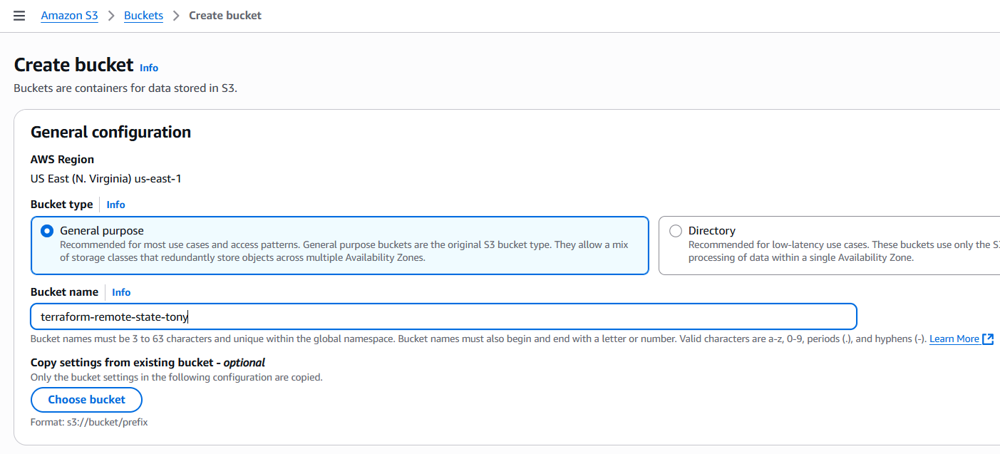
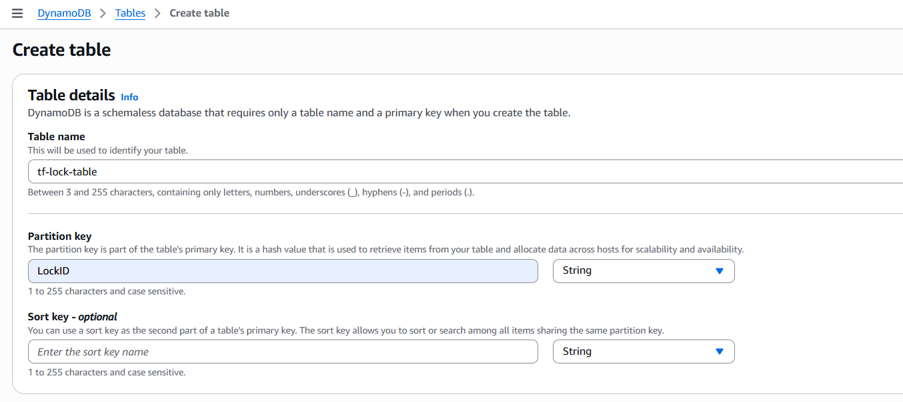
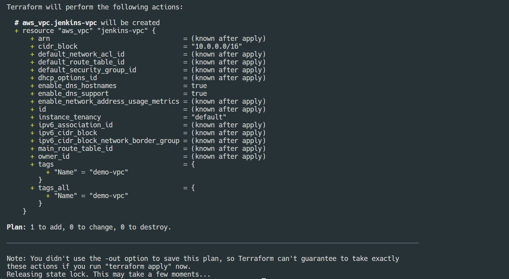
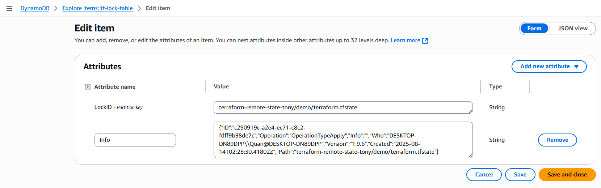
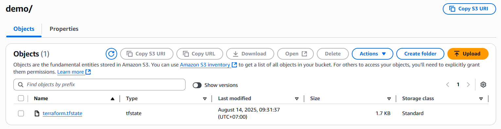
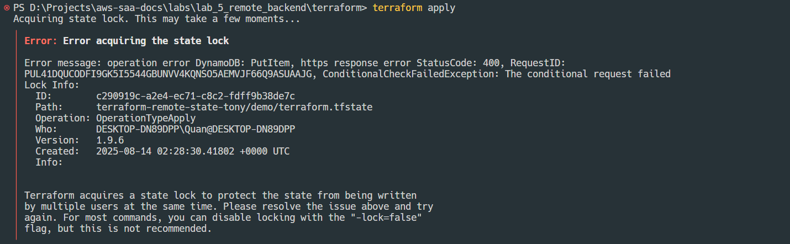

Lab 5: Terraform Remote Back-end with AWS S3 and DynamoDB
=========================================================

In this lab, you will:
+ Create the backend resources (S3 + DynamoDB)
+ Configure Terraform to work with remote backend
+ Test state locking

## Lab instructions

### 1. Create S3 bucket for Terraform state
Create a new bucket in S3:
+ Bucket name: terraform-remote-state-tony
+ Region: us-east-1 (any region you want)
+ Bucket Versioning: Enable



### 2. Create DynamoDB table for state locking
Create a new table in DynamoDB:
+ Table name: tf-lock-table
+ Partition key: LockID (String) - this specific value is required
+ Rest of settings are default



### 3. Configure Terraform to use remote backend
Inside your Terraform project, edit `main.tf` like this:
```json
terraform {
  backend "s3" {
    bucket         = "terraform-remote-state-tony"   # Your bucket name
    key            = "demo/terraform.tfstate"        # Path inside the bucket
    region         = "us-east-1"                     # Your bucket region
    dynamodb_table = "tf-lock-table"                 # Lock table name
    encrypt        = true
  }
}
```
Run the project:
```
terraform init
terraform plan
```



Terraform will now:
+ Use DynamoDB to lock state so two applies can’t run at once.
+ Store the state file in the S3 bucket.




### 4. Test State locking
Open two terminals in the same project.

Run `terraform apply` in one — keep it waiting for approval.

In the second terminal, run `terraform apply`.

The terminal will display an error, saying the state is locked and cannot be acquired.



### 5. Clean up
Run `terraform destroy` to remove any created resources.

Remove DynamoDB table.

Empty and remove S3 bucket.