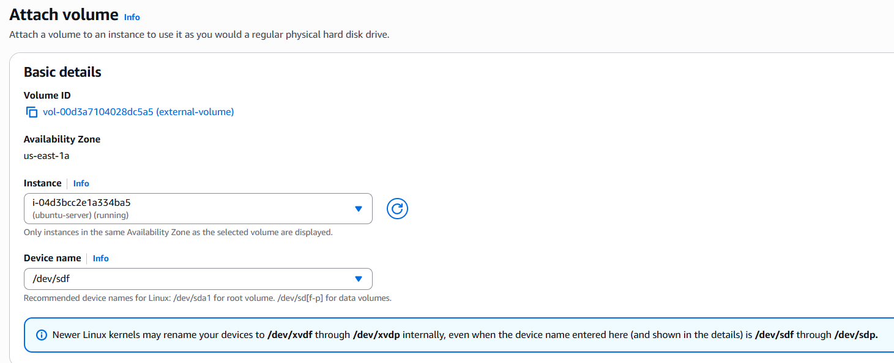
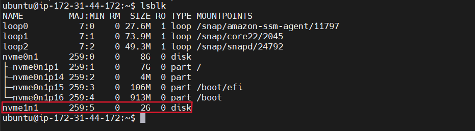
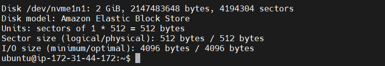
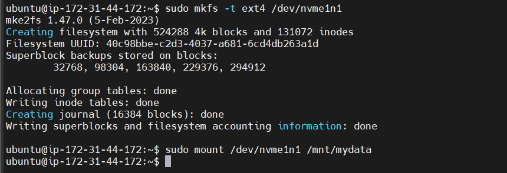
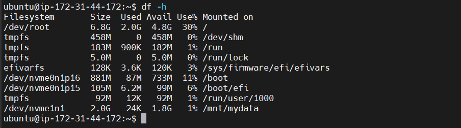

Lab 5: AWS EBS Volume Usage
=========================================================

In this lab, you will:
+ Create an EBS volume and attach it to an EC2
+ Move volume between AZs with snapshot

## Lab instructions

### 1. Attach the EBS Volume to Your EC2 Instance

Go to **AWS Management Console** → **EC2** → **Volumes**.

Select your EBS volume → click **Actions** → **Attach Volume**.

Choose the EC2 instance you want to attach it to.

Note the device name (e.g., /dev/sdf or /dev/xvdf) – you will need it later.

Click **Attach Volume**.



Check if the volume is attached: 
```bash
lsblk
```


```bash
sudo fdisk -l
```


### 2. Create a Mount Point and Mount the Volume

Convert the volume:
```bash
sudo mkfs -t ext4 /dev/nvme1n1
```
⚠️ Warning: This will erase any existing data on the volume. If it’s an old volume, skip this step.

Create a directory to mount it:
```bash
sudo mkdir /mnt/mydata
sudo mount /dev/nvme1n1 /mnt/mydata
```


Verify Mount:
```bash
df -h
```

