Lab 7: Application deployment with ECS, Fargate and ELB
=========================================================

In this lab, you will:
+ Create an ECS cluster with Fargate
+ Run a task to deploy a containerized web application
+ Configure Auto Scaling based on CPU utilization.
+ Expose the app with ALB

## Lab instructions

### 1. Prepare the Container Image

Go to Amazon ECR → Create repository
+ Repository name: ecs-fargate-demo
+ Visibility: Private
+ Click Create repository

(Optional) If you don’t have your own image, you can use the public image in this lab instead of pushing your own.
+ `docker.io/tonyq2k3/lab7_frontend`
+ `docker.io/tonyq2k3/lab7_backend`

### 2. Create an ECS Cluster

Go to **ECS** → **Clusters** → **Create cluster**
+ **Cluster name**: ecs-fargate-cluster
+ **Infrastructure**: Fargate only

Leave all other defaults and click Create.

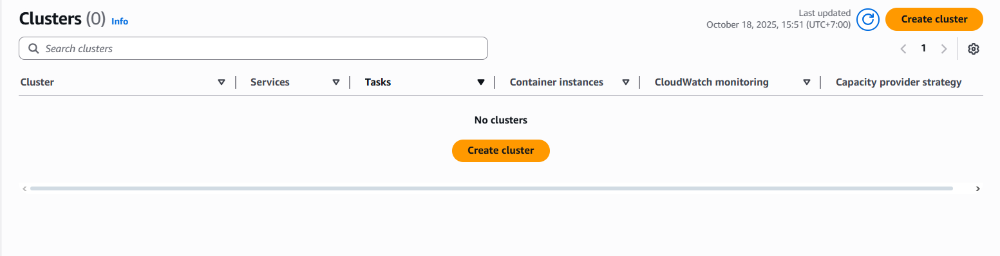
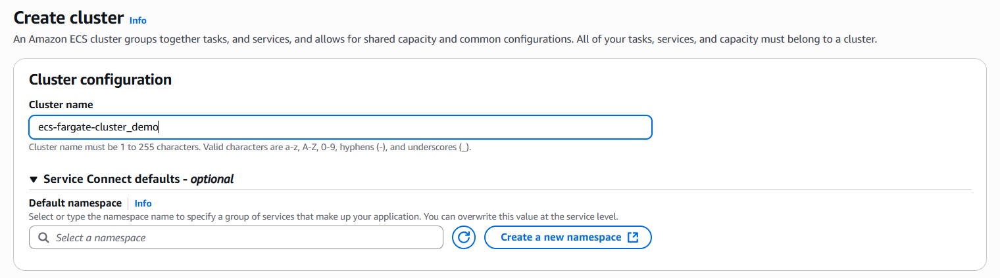

### 3. Create a Task Definition

In the ECS Console, go to **Task Definitions** → **Create new task definition**:
+ Choose **Fargate**
+ **Task definition name**: ecs-fargate-demo-task

Under **Operating system/Architecture**:
+ Linux/X86_64

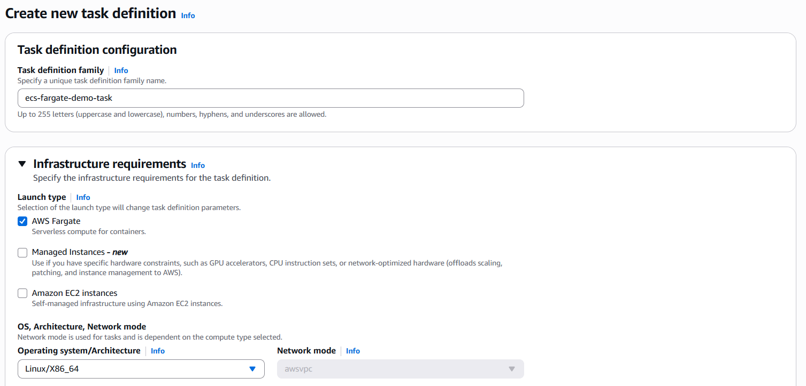

Under **Task size**, choose:
+ CPU: 1 vCPU
+ Memory: 2 GB

Under **Task roles**, choose a role that fits your need, we actually don't need any in this demo since the app doesn't interact with any other AWS services.

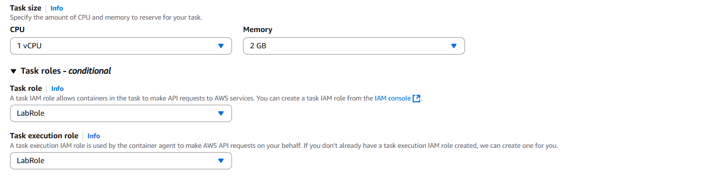

Under **Container definitions**, click **Add container**

**Container 1**:
+ Name: front-end
+ Image: docker.io/tonyq2k3/lab7_frontend
+ Port mappings: 80 (container port)

**Container 2**:
+ Name: back-end
+ Image: docker.io/tonyq2k3/lab7_backend
+ Port mappings: 8000 (container port)

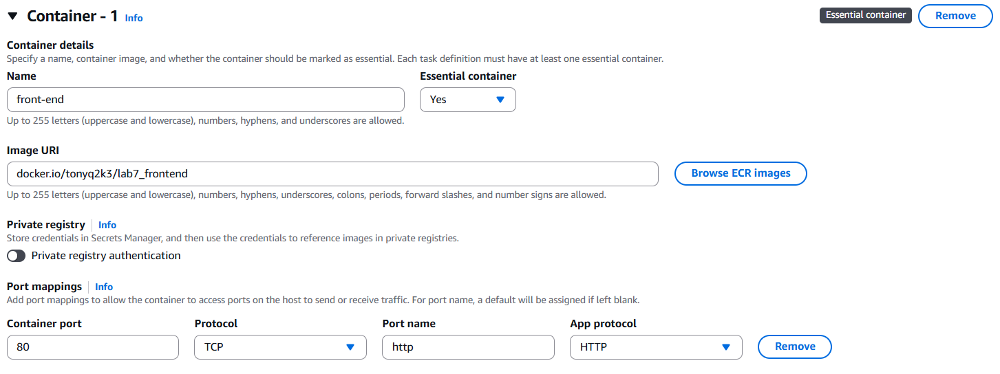
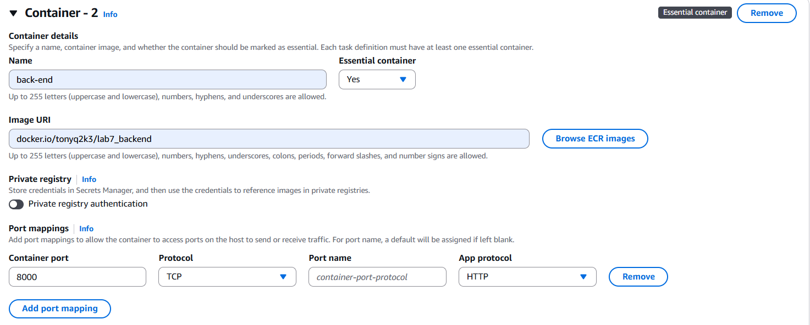

Click **Create**

### 5. Create the ECS Service

In ECS, go to your cluster → Services → Create
+ Launch type: Fargate
+ Task definition: ecs-fargate-demo-task:1
+ Cluster: ecs-fargate-cluster

Configure:
+ Service name: ecs-demo-service
+ Number of tasks: 2

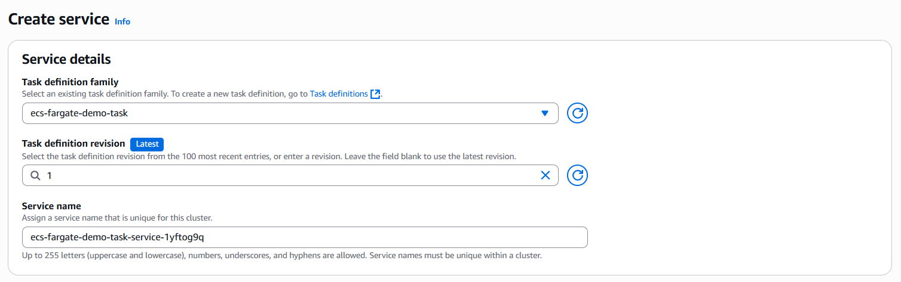
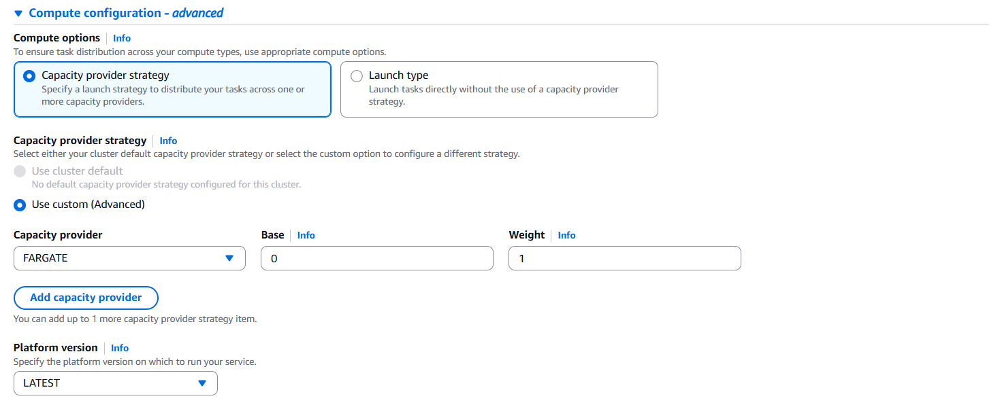

Under **Networking**, choose:
+ Your VPC
+ Two public subnets
+ Security group: Create a new one → allow HTTP (port 80) from anywhere
+ Check Auto-assign public IP

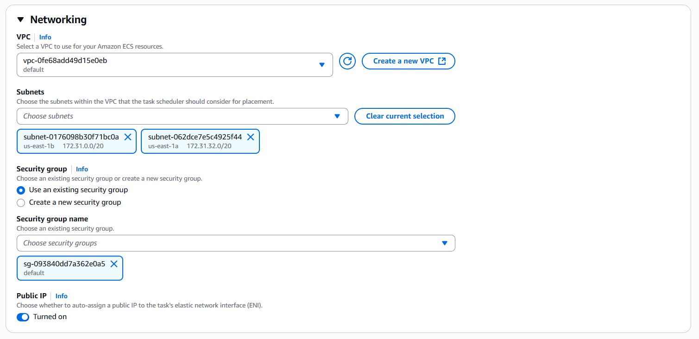

Under **Load balancing**, choose:
+ Load balancer type: Application Load Balancer
+ Select your ALB: ecs-demo-alb
+ Listener: HTTP:80 → Add to load balancer
+ Target group: ecs-demo-tg

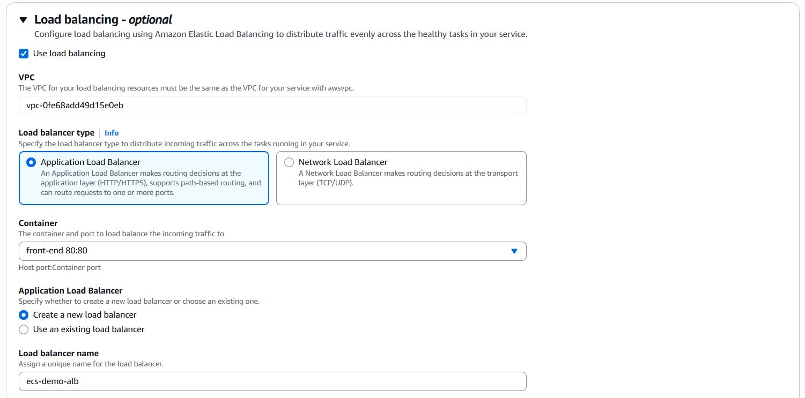
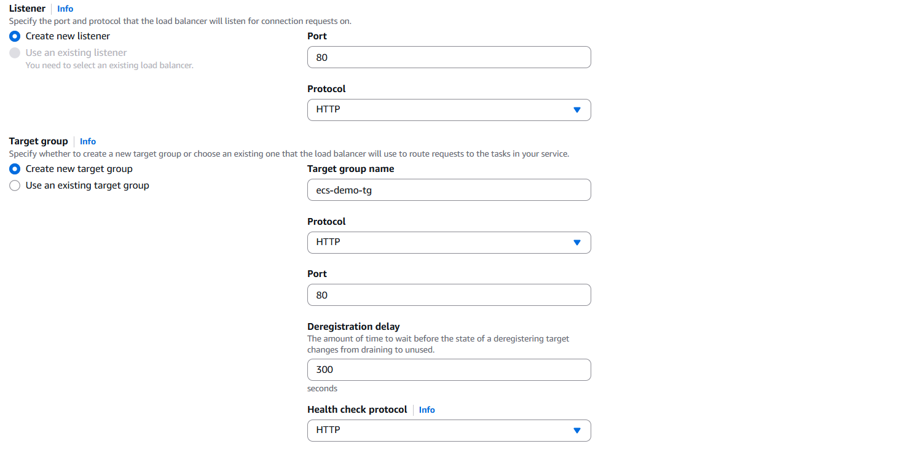

Under **Auto Scaling** → click Edit
Enable Service Auto Scaling

Configure:
+ Minimum number of tasks: 2
+ Desired tasks: 2
+ Maximum number of tasks: 5

Add a scaling policy:
+ Policy type: Target tracking
+ Metric type: ECSServiceAverageCPUUtilization
+ Target value: 60%

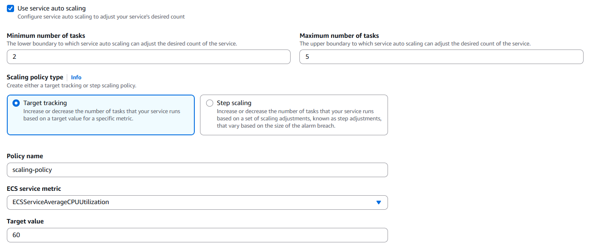

Click **Create Service**

### 7. Test the Deployment

Go to EC2 > Load Balancers

Copy the DNS name of your ALB. Open it in your browser. You should see the Nginx default page or your custom app’s output.

To simulate load:

+ You can use an online HTTP load generator, or
+ From your local terminal:
```bash
ab -n 10000 -c 50 http://<alb-dns-name>/
```

Return to the ECS console → Service → Tasks tab

Observe new tasks being created when CPU > 60%

After load stops, tasks scale back down.

### 8. Cleanup

To avoid charges, delete resources:

Delete ECS Service
→ Cluster → Service → Actions → Delete service

Delete ECS Cluster
→ Clusters → ecs-fargate-cluster → Delete

Delete Load Balancer and Target Group
→ EC2 → Load Balancers / Target Groups → Delete

Delete ECR Repository (optional)