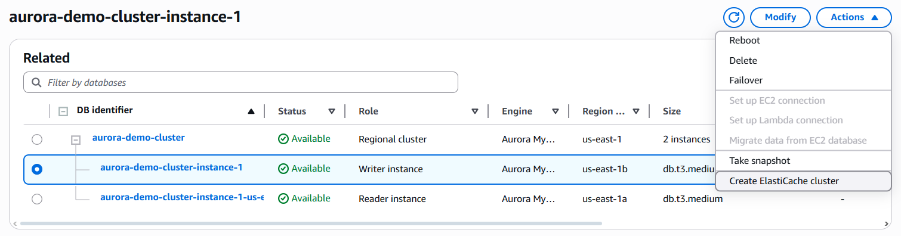

Lab 8: Multi-AZ Database with Aurora RDS
=========================================================

In this lab, you will:
+ Creating an Amazon Aurora DB cluster (with Multi-AZ for HA).
+ Failover testing within the same region.
+ Disaster Recovery setup using a Global Database (cross-region replica).
+ Failover to the DR region.

To learn:
+ Cluster storage configuration: Aurora I/O-Optimized vs Standard
+ DB instance class: Serverless vs Memory optimized classes vs Burstable classes

## Lab instructions

### 1. Create an Aurora DB Cluster (Multi-AZ)

Go to **AWS Management Console** → **RDS** → **Databases** → **Create database**.
+ Engine type: Amazon Aurora
+ Edition: Choose Aurora MySQL (for example)
+ Capacity type: Provisioned

Under **Templates**, select `Production`.

Set DB cluster identifier → `aurora-demo-cluster`

**Credentials Settings**: Password authentication.

Under **Credentials**, set:
+ Username: admin
+ Password: AuroraDemo123!

**Cluster Storage configuration**: Aurora I/O Optimized

**Instance class**: `db.t3.medium`

Under **Availability & durability**:
+ Select Multi-AZ DB cluster (recommended).
+ This creates a primary and standby instance in different Availability Zones.

**Connectivity**:
+ Choose or let AWS create a new VPC and subnets automatically.
+ Public access → Yes (for easy connection testing)
+ Select an existing security group or create one allowing MySQL (port 3306) from your IP.

Leave the rest of the configs default.

## 2. Verify Multi-AZ and Perform Failover

Once the cluster is available:

Go to **RDS** → **Databases** → `aurora-demo-cluster`.

You should see two instances, both share the same underlying distributed storage: 
+ One marked Writer: The primary instance that handles all read and write operations. This is the main connection endpoint (applications write here).
+ One marked Reader: A standby instance that continuously replicates data from the writer. Used for failover.

To test HA failover:
+ Click on the Actions dropdown → Failover (AWS will pretend the primary DB instance (writer) just failed and switch the writer role to one of the reader instances.)
+ Confirm failover → AWS will promote the standby.
+ Verify the Writer and Reader roles swapped.

This demonstrates automatic failover for Multi-AZ high availability.

## 3. Clean-up

When done, delete:

The Global Database (disable delete protection first, then delete).

The Aurora clusters in both regions.

Any security groups, subnets, or VPCs created for this lab.